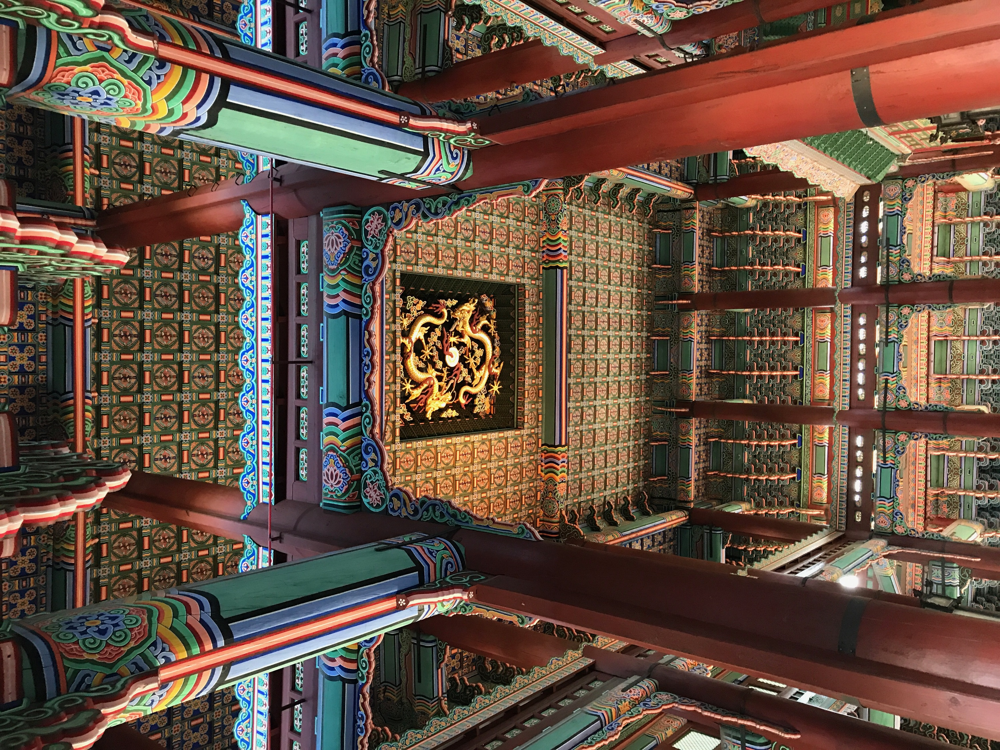

# My Second README.md

## Ferrol Brown

**Second Project!!!**

This second project (or at least the first part of this project) has been much
smoother than the first assignment. I am much more familiar with Github and Atom.
Thankfully I don't have as many problems as my classmates with Atom. Problems my classmates had were:


---

1. the Atom application crashing
2. Getting 404 errors

---

I did have 404 errors on my last project, but thankfully this time, no errors! Yay!
Mainly I had to focus on:

---
- learning new lingo for HTML
- making sure I had all the correct file names
- tyring to get done as much as I could as fast as I could, because I was away on a trip to South Korea and Japan for about 2 weeks.
- Thats why this project is turned in so late! Sorry!!!! I tried to do as much as I could, but my wifi was quite limited.
---

**BUT** my trip to South Korea and Japan was *great* experience, and a once in a lifetime opportunity. So even if I do not get full credit for this project, I do not regret going. It was absolutely life changing.
 


```markdown
# I think HTML is a quite useful language to know.
## I think at times, it will be tricky for me to remember how to use it, if I don't use it often enough.
### I remember when I first started to learn HTML on Kahn Academy, I forgot everything because I didn't use it enough.
#### This class may help me to remember, because I may use it more often now.

```

---
This instructional project was kind of fun for me. I like tutorials!

---
But I discovered I'm not so good at it. Or at least I didn't practice enough of making my item. I did it! But it looked quite unprofessional and not instagram worthy!

---
But the job got done, and my project tasted really good regardless of appearances.

---
Something I was not able to figure out was, but I didn't think it was too big of a deal: I could not get my ordered list numbers to center with my text area. They always lined up to the left.

---

I really liked that I was able to play a little bit with colors and fonts in this project! A little more creative freedom!!!


**I DID IT!!!**

Overall I think the process wasn't difficult, just a bit tedious, again, like the last project.

As *always* I had some struggles here and there with HTML, but thankfully the internet is full of resources and people like me that make the same mistakes that I do. I am also able to learn a lot from the Github issues, with my classmates.

**Week 2 updates**

I *definitely* noticed my mistakes I made from the first week. I really didn't read the instructions that well. I think I was really in too much of a rush to try and finish before the deadline. It pays to **READ**. BUT! This is how we learn; we make mistakes.

---

I only had a little trouble with a few images, but it was easily fixed when I remembered we had to put an extra "." in the source:

```markdown
<../images/rice.jpg> instead of <./images/rice.jpg>
```

Any hoodle doodle...I'm not sure I would say I am a coding master by any means, but I am starting to get the hang of it more. I think if I used it more, I would remember more over time. But like any language you have to keep at it to learn it better and to retain it.
