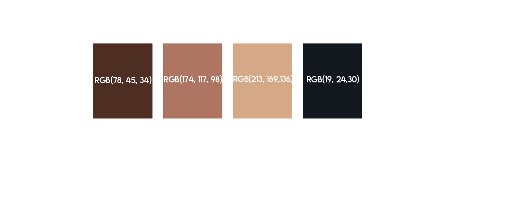
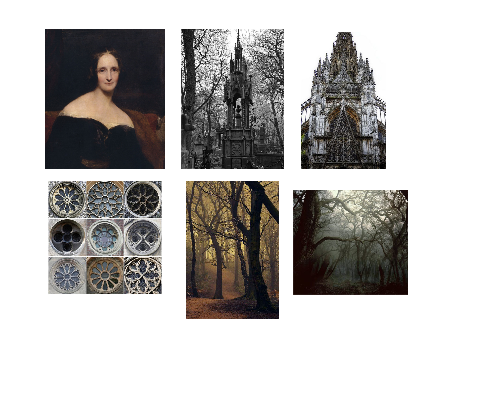

# My THIRD readme.md

## Ferrol Brown

**Back again! And attacking CSS this time!**

Hello again, fellow peers and instructor. Once again, I'm heading into unknown territory, and am intimidated. *BUT* I am happy that this project is including literature: something I can amateurly nerd out on. So, what is more of an appropriate piece of literature for October (and most likely stretching into November), than Frankenstein. Thank you high school AP English for introducing me to a book I love, regardless of the season.

---

Thus! I will get my materials from Mary Shelley's *Frankenstein*.

___

I will obviously applaud Shelley for her work, because I think there is a lot of value in it.
___

The pallet I would like to use would include these four colors. I gathered them from Mary Shelley's portrait. After all, she is the essence of *Frankenstein*.

Contrary to Hollywood depictions, the "monster", reffered to as "the creature" in the novel (also contrary to popular belief: the creator is Frankenstein, the creature is never given a name) is described to have tight translucent yellow skin. Not green with bolts in his neck. So, that's why I'm staying away from the classic green and black color scheme.

---

I would like to have a gothic style to the website, as Shelley's work is a "gothic novel". So, I'd like to incorporate gothic archictecture into the interface (i.e. gothic cathedral windows for buttons). Silhouetted bare tree limbs against a dark background would also help to create the ominous feeling that Frankenstein has. Here is my mood board for inspiration.

