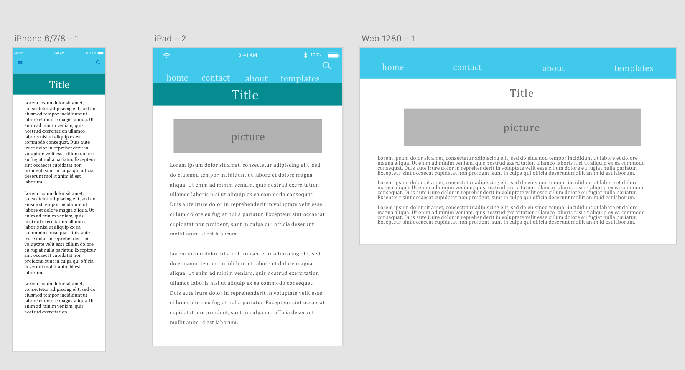

# My Fourth readme.md

## Ferrol Brown

**Back again! And attacking RWD this time!**

**What is the information this page aims to deliver?**
The page aims to deliver simply the importance of RWD.

**What is the first information on the page that should draw the eye?**
The first information that draws the eye is the menu bar because of it's bright blue color.

**What is the primary content of this page?**
The primary content is the information on the importance of RWD.

**What is the secondary content?**
The secondary content is the menu (which right now doesn't really lead to anyting).

For design I want to stick to a nice pallete of cool colors specifically blues and whites. I already know the site isn't going to be very pretty (unfortunately). Maybe its because I'm not efficient with HTML and CSS yet, but I feel VERY VERY VERY limited with what I can do style-wise. I know its important to learn the fundamentals, but I feel like I would do much better with programs like Muse and XD than writing from scratch.

Here are my wire frames that I initially came up with for the site:

Like I said I'm not very good at codeing, so it didn't turn out the way I quite would like it, but its okay. This is good practice at least. 
